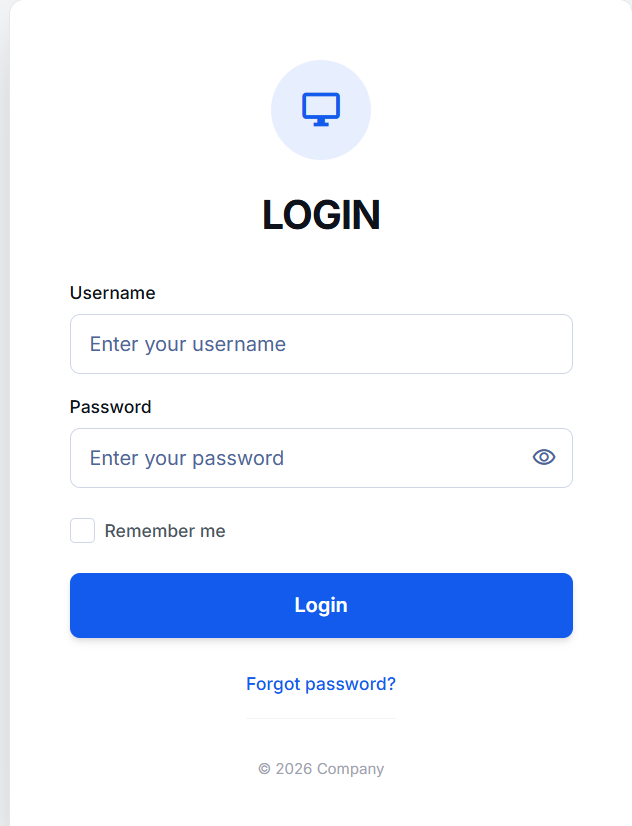
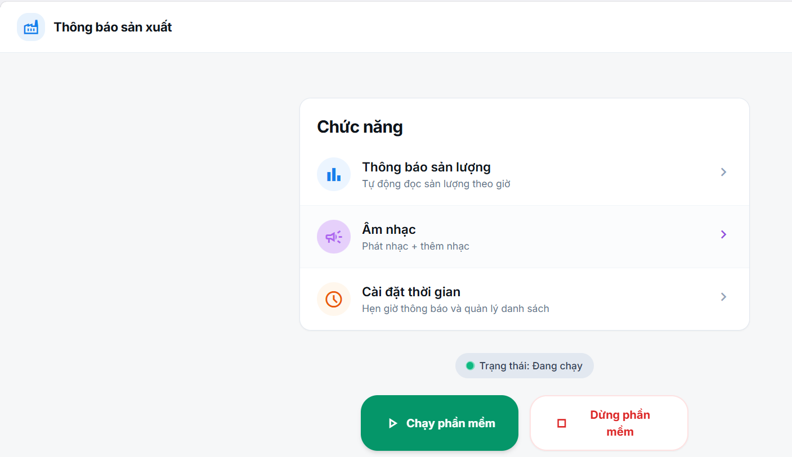
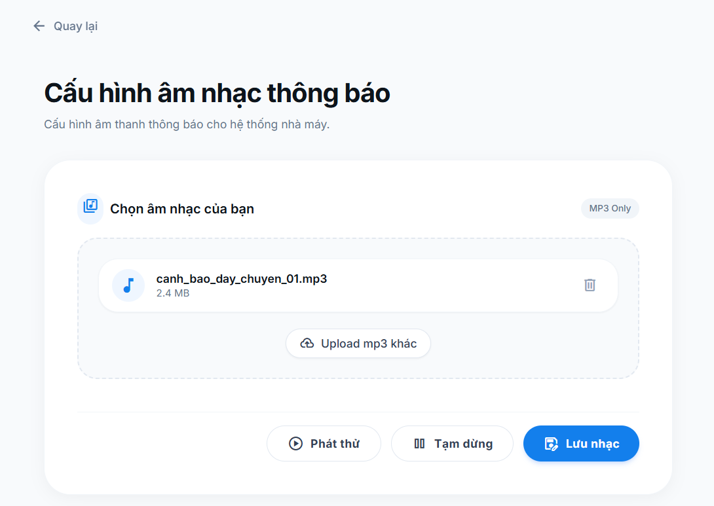
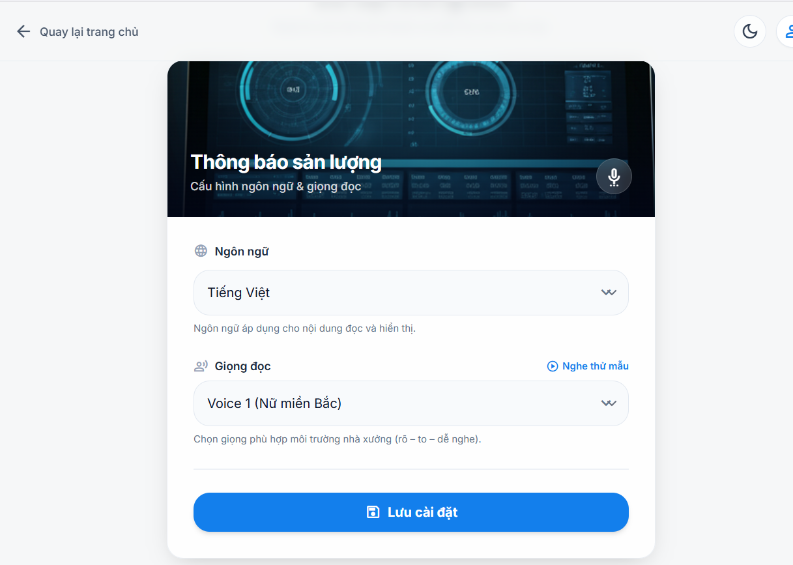
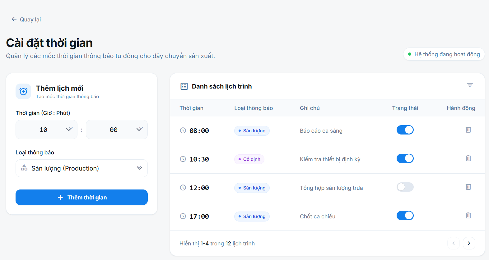
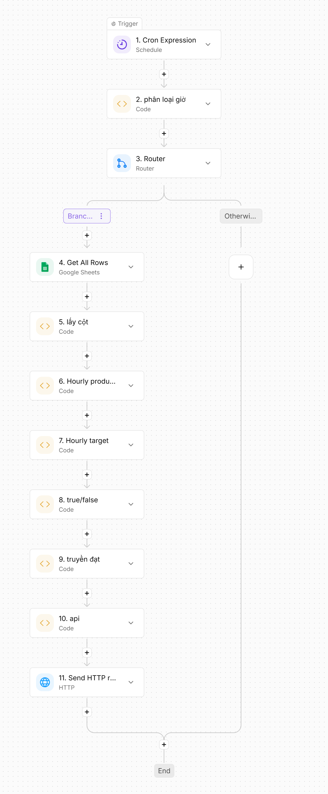

# MyLoginApp - Ứng dụng thông báo sản xuất và n8n Automation

MyLoginApp là ứng dụng Windows dùng để phát thông báo trong nhà xưởng. Ứng dụng có giao diện đăng nhập, màn hình chức năng, cấu hình giọng đọc, chọn nhạc MP3, đặt lịch thông báo và kết nối n8n để tự động đọc báo cáo sản lượng theo giờ.

Ứng dụng được viết bằng **C# WinForms .NET 8**, hiển thị giao diện bằng **WebView2** từ các file HTML trong thư mục `UI`, phát âm thanh bằng **NAudio**, và đọc nội dung thông báo bằng **OpenAI TTS**.

## Hình ảnh giao diện

### 1. Đăng nhập



### 2. Trang chức năng chính



### 3. Cấu hình âm nhạc



### 4. Cấu hình thông báo sản lượng và giọng đọc



### 5. Cài đặt thời gian thông báo



### 6. Workflow n8n Automation



## Tính năng chính

- Đăng nhập người dùng trước khi vào hệ thống.
- Bật/tắt trạng thái chạy phần mềm.
- Poll dữ liệu từ n8n webhook để nhận nội dung cần đọc.
- Đọc thông báo bằng OpenAI TTS.
- Phát file MP3 cảnh báo hoặc nhạc nhà xưởng.
- Cấu hình ngôn ngữ, giọng đọc, tốc độ đọc và nội dung mẫu.
- Tạo lịch thông báo theo giờ/phút.
- Tự động kiểm tra sản lượng theo giờ từ n8n và Google Sheets.
- Lưu cấu hình cục bộ trên máy Windows.

## Cấu trúc thư mục

```text
MyLoginApp/
  Form1.cs
  Form1.Designer.cs
  Program.cs
  MyLoginApp.csproj
  app.ico
  UI/
    code.html
    function.html
    music.html
    notification.html
    settime.html
  N8N/
    phanloaigio.js
    laycot.js
    Hour.js
    Hourtarget.js
    true/flase.js
    dat.js
    url.js
  docs/
    images/
      01-login.png
      02-function.png
      03-music.png
      04-notification.png
      05-settime.png
      06-n8n-workflow.png
```

## Yêu cầu cài đặt

- Windows 10/11.
- .NET 8 SDK hoặc .NET 8 Desktop Runtime.
- Microsoft Edge WebView2 Runtime.
- Internet để tải Tailwind/Google Fonts trong giao diện HTML.
- Tài khoản n8n hoặc server n8n đang chạy.
- Google Sheets chứa dữ liệu sản lượng.
- OpenAI API key để dùng chức năng đọc giọng nói.

Các package NuGet đang dùng:

- `Microsoft.Web.WebView2`
- `NAudio`
- `NAudio.WaveFormRenderer`

## Chạy ứng dụng

Mở terminal tại thư mục dự án:

```powershell
cd F:\myloginapp
dotnet restore
dotnet build
dotnet run
```

Khi build bằng Visual Studio, có thể mở file:

```text
MyLoginApp.sln
```

## Đăng nhập

Màn hình đăng nhập nằm ở:

```text
UI/code.html
```

Ứng dụng kiểm tra tài khoản trong `Form1.cs`. Tài khoản mặc định hiện có:

```text
Username: admin
Password: 123456
```

Ngoài tài khoản mặc định, ứng dụng có hỗ trợ đọc danh sách tài khoản từ:

```text
%AppData%\YourApp\admin_config.json
```

Mật khẩu trong file cấu hình admin được mã hóa bằng DPAPI theo user Windows hiện tại nếu `UseDpapiForPassword = true`.

## Luồng sử dụng phần mềm

1. Mở MyLoginApp.
2. Đăng nhập bằng tài khoản hợp lệ.
3. Tại trang chức năng, bấm **Chạy phần mềm**.
4. Khi trạng thái chuyển sang **Đang chạy**, các chức năng sẽ được mở khóa.
5. Chọn một trong các mục:
   - **Thông báo sản lượng**: cấu hình giọng đọc và nội dung đọc.
   - **Âm nhạc**: upload/phát/tạm dừng/lưu file MP3.
   - **Cài đặt thời gian**: tạo lịch thông báo tự động.
6. Bấm **Dừng phần mềm** khi muốn ngừng polling n8n.

## Cấu hình OpenAI TTS

Ứng dụng đọc nội dung bằng OpenAI TTS trong hàm `SpeakWithOpenAiAsync`.

Tạo file `openai_key.txt` cùng thư mục với file `.exe` sau khi build, ví dụ:

```text
bin\Debug\net8.0-windows\openai_key.txt
```

Nội dung file chỉ gồm API key:

```text
sk-...
```

Trong `Form1.cs`, hàm `OpenAiTtsToMp3Async` đang có endpoint mẫu:

```csharp
const string url = "xxxxxxxxxxxxxxxxxxxxxxxxxxxxx";
```

Khi triển khai thật, cần thay bằng endpoint OpenAI TTS hợp lệ. Sau khi tạo giọng đọc, app lưu MP3 tạm vào:

```text
bin\Debug\net8.0-windows\temp\
```

## Cấu hình n8n webhook trong MyLoginApp

Ứng dụng polling n8n bằng HTTP GET trong hàm `PollN8nOnce`.

Response n8n mà app cần nhận:

```json
{
  "text": "Nội dung cần đọc qua loa"
}
```

Nếu không có nội dung mới, n8n nên trả về:

```http
204 No Content
```

Nếu có nội dung, app sẽ:

1. Lấy field `text`.
2. Chống đọc trùng trong khoảng 3 giây.
3. Gửi nội dung sang OpenAI TTS.
4. Phát file MP3 bằng NAudio.

Webhook URL được lấy theo thứ tự:

1. URL trong cấu hình admin sau khi đăng nhập.
2. `DEFAULT_N8N_WEBHOOK_URL` trong `Form1.cs`.

Hiện tại `DEFAULT_N8N_WEBHOOK_URL` đang để trống, nên cần cấu hình URL thật trước khi chạy production.

## Cấu hình thông báo sản lượng

Màn hình:

```text
UI/notification.html
```

Mục đích:

- Chọn ngôn ngữ đọc.
- Chọn giọng đọc.
- Nghe thử mẫu.
- Lưu cấu hình.

Cấu hình được lưu tại:

```text
bin\Debug\net8.0-windows\settings.json
```

Dữ liệu lưu gồm:

```json
{
  "language": "vi",
  "voice": "alloy",
  "text": "Nội dung thông báo mẫu",
  "rate": 50
}
```

`rate` nằm trong khoảng `0..100` và được quy đổi sang tốc độ đọc khoảng `0.75x..1.35x`.

## Cấu hình âm nhạc

Màn hình:

```text
UI/music.html
```

Chức năng:

- Chọn file MP3.
- Phát thử.
- Tạm dừng.
- Lưu file nhạc đang chọn.

Đường dẫn file MP3 được lưu tại:

```text
%AppData%\YourApp\music_path.txt
```

Khi tới lịch phát nhạc, ứng dụng dùng đường dẫn này để phát file bằng NAudio.

## Cài đặt thời gian

Màn hình:

```text
UI/settime.html
```

Ứng dụng có timer chạy mỗi 1 giây để kiểm tra lịch. Lịch được lưu tại:

```text
%AppData%\YourApp\schedules.json
```

Cấu trúc một lịch:

```json
{
  "id": "schedule-001",
  "time": "08:00",
  "type": "thông báo",
  "note": "Nội dung cần đọc",
  "enabled": true
}
```

Các loại lịch mà `Form1.cs` đang xử lý:

- `âm nhạc`: phát file MP3 đã chọn.
- `thông báo`: đọc nội dung đã lưu trong cấu hình thông báo.
- `tinh chỉnh giọng đọc`: đọc nội dung trong field `note`.

Lưu ý: giao diện `settime.html` hiện đang có option mẫu như `san-luong` và `co-dinh`, trong khi C# đang so sánh bằng chuỗi tiếng Việt như `âm nhạc`, `thông báo`, `tinh chỉnh giọng đọc`. Khi triển khai thật, nên đồng bộ lại giá trị `type` giữa HTML và C#.

## n8n Automation

Thư mục `N8N` chứa code để dán vào các node Code trong n8n. Workflow theo ảnh gồm:

1. **Cron Expression**
2. **phan loai gio**
3. **Router**
4. **Get All Rows**
5. **lay cot**
6. **Hourly production**
7. **Hourly target**
8. **true/false**
9. **truyen dat**
10. **api**
11. **Send HTTP request**

### 1. Cron Expression

Node này hẹn giờ chạy workflow.

Các mốc trong `phanloaigio.js` hiện là:

```text
09:15
10:15
11:15
12:45
13:45
14:45
15:45
```

Nên cấu hình Cron chạy mỗi phút hoặc chạy đúng các mốc trên, sau đó để node `phan loai gio` quyết định có tiếp tục hay không.

### 2. phan loai gio

File:

```text
N8N/phanloaigio.js
```

Output:

```json
{
  "hour": 9,
  "minute": 15,
  "ca": "CA LÀM",
  "time": "9:15"
}
```

Nếu không đúng mốc giờ, `ca` sẽ là:

```text
KHÔNG PHẢI CA LÀM
```

### 3. Router

Router nên tách nhánh:

- Nhánh chính: `ca = CA LÀM`
- Nhánh còn lại: kết thúc workflow

### 4. Get All Rows

Node Google Sheets lấy dữ liệu sản lượng.

Output của node này cần truyền sang `laycot.js` với input name:

```text
excel
```

### 5. lay cot

File:

```text
N8N/laycot.js
```

Node này gom dữ liệu theo chuyền `C1..C10`, dừng khi gặp dòng `CẮT` hoặc `CAT`, và map các cột:

| Cột | Ý nghĩa |
| --- | --- |
| A | Chuyền |
| H | DM/NGÀY |
| I | DM/GIỜ |
| J | AFTER 9H |
| K | AFTER 10H |
| L | AFTER 11H |
| M | AFTER 12H30 |
| N | AFTER 13H30 |
| O | AFTER 14H30 |
| P | AFTER 15H30 |
| Q | AFTER 16H30 |

Output mẫu:

```json
{
  "CHUYEN": "C1",
  "DM/NGAY": 800,
  "DM/GIO": 100,
  "AFTER 9H": 95,
  "AFTER 10H": 210
}
```

### 6. Hourly production

File:

```text
N8N/Hour.js
```

Node này lấy giờ Việt Nam hiện tại và chọn cột sản lượng tương ứng:

| Giờ | Cột lấy sản lượng |
| --- | --- |
| 9 | AFTER 9H |
| 10 | AFTER 10H |
| 11 | AFTER 11H |
| 12 | AFTER 12H30 |
| 13 | AFTER 13H30 |
| 14 | AFTER 14H30 |
| 15 | AFTER 15H30 |
| >=16 | AFTER 16H30 |

Output thêm các field:

```json
{
  "GIO_HIEN_TAI": "10:15",
  "COT_SAN_LUONG": "AFTER 10H",
  "SAN_LUONG_GIO": 210
}
```

### 7. Hourly target

File:

```text
N8N/Hourtarget.js
```

Node này tính định mức lũy tiến theo hệ số giờ:

| Giờ | Hệ số |
| --- | --- |
| 9 | 1 |
| 10 | 2 |
| 11 | 3 |
| 12 | 4 |
| 13 | 5 |
| 14 | 6 |
| 15 | 7 |
| >=16 | 8 |

Công thức:

```text
DM/GIO lũy tiến = DM/GIO gốc * hệ số giờ
```

### 8. true/false

File:

```text
N8N/true/flase.js
```

Node này so sánh sản lượng thực tế với định mức:

```text
SAN_LUONG_GIO >= DM/GIO => ĐẠT
SAN_LUONG_GIO <  DM/GIO => KHÔNG ĐẠT
```

Output mẫu:

```json
{
  "CHUYEN": "C1",
  "GIO_HIEN_TAI": "10:15",
  "DM/GIO": 200,
  "SAN_LUONG_GIO": 210,
  "DAT": true,
  "KHONG_DAT": false,
  "THIEU": 0,
  "VUOT": 10,
  "TRANG_THAI": "ĐẠT"
}
```

### 9. truyen dat

File:

```text
N8N/dat.js
```

Node này tạo câu thông báo cho các chuyền đạt và chưa đạt.

Output:

```json
{
  "message": "Sản lượng các chuyền 1, chuyền 2 đã đạt định mức..."
}
```

### 10. api

File:

```text
N8N/url.js
```

Node này tạo thông tin gửi API. Hiện file đang dùng placeholder:

```js
const apiKey = "xxxxxx";
return {
  url: "xxxxxxxxxxxx",
  apiKey,
  factoryId: "xxxxx",
  text: xxxx
};
```

Khi dùng thật, cần sửa thành:

```js
export const code = async (inputs) => {
  const apiKey = "API_KEY_THAT";

  const message =
    inputs.message ??
    inputs.text ??
    inputs.data?.message ??
    inputs.rows?.message ??
    "";

  return {
    url: "WEBHOOK_OR_API_URL_THAT",
    apiKey,
    factoryId: "FACTORY_ID_THAT",
    text: message
  };
};
```

### 11. Send HTTP request

Node HTTP Request gửi message đến endpoint thật.

Nếu endpoint là n8n webhook cho MyLoginApp polling, response cuối nên có dạng:

```json
{
  "text": "Nội dung cần đọc"
}
```

Nếu endpoint là API trung gian, cần đảm bảo MyLoginApp có thể GET lại nội dung từ URL đã cấu hình.

## Google Sheets đầu vào

File Google Sheets cần giữ đúng cấu trúc cột đang dùng trong `laycot.js`.

Các điểm quan trọng:

- Cột A chứa mã chuyền dạng `C1`, `C2`, ..., `C10`.
- Dữ liệu của một chuyền có thể nằm nhiều dòng liên tiếp.
- Dòng `CẮT` hoặc `CAT` dùng để kết thúc vùng đọc.
- Cột H là định mức ngày.
- Cột I là định mức giờ.
- Cột J đến Q là sản lượng lũy tiến theo các mốc giờ.

Không nên đổi vị trí cột nếu chưa sửa lại file:

```text
N8N/laycot.js
```

## Checklist triển khai

- [ ] Cài .NET 8 Desktop Runtime.
- [ ] Cài WebView2 Runtime.
- [ ] Restore/build project thành công.
- [ ] Tạo `openai_key.txt` cạnh file `.exe`.
- [ ] Cấu hình endpoint OpenAI TTS trong `Form1.cs`.
- [ ] Cấu hình `DEFAULT_N8N_WEBHOOK_URL` hoặc URL trong admin config.
- [ ] Import workflow n8n.
- [ ] Dán đúng code trong thư mục `N8N` vào từng node.
- [ ] Node Google Sheets đọc đúng file.
- [ ] Input từ Google Sheets sang `laycot.js` đặt tên là `excel`.
- [ ] Input giữa các node sau đặt tên là `rows` hoặc map đúng output.
- [ ] `url.js` đã thay placeholder bằng URL/API key thật.
- [ ] MyLoginApp nhận được JSON có field `text`.
- [ ] Loa/máy tính phát được âm thanh.

## Lỗi thường gặp

### Đăng nhập không được

- Kiểm tra username/password.
- Thử tài khoản mặc định `admin / 123456`.
- Kiểm tra file `%AppData%\YourApp\admin_config.json` nếu dùng tài khoản riêng.

### Bấm Chạy phần mềm nhưng không nghe thông báo

- Kiểm tra n8n webhook URL có trống không.
- Kiểm tra n8n có trả `{ "text": "..." }` không.
- Kiểm tra `openai_key.txt` đã đặt đúng thư mục chưa.
- Kiểm tra endpoint OpenAI TTS trong code.
- Kiểm tra loa Windows.

### n8n không lấy được dữ liệu Google Sheets

- Kiểm tra credential Google Sheets.
- Kiểm tra quyền truy cập file.
- Kiểm tra sheet/range.
- Kiểm tra output đã truyền vào `laycot.js` với tên `excel`.

### Kết quả đạt/không đạt sai

- Kiểm tra cột H, I, J-Q trong Google Sheets.
- Kiểm tra giờ chạy workflow.
- Kiểm tra hệ số giờ trong `Hourtarget.js`.
- Kiểm tra dữ liệu số có chứa dấu phẩy, ký tự `%`, dòng rỗng hoặc lỗi Excel.

### Lịch không chạy

- Kiểm tra file `%AppData%\YourApp\schedules.json`.
- Kiểm tra field `enabled = true`.
- Kiểm tra `type` có đúng chuỗi C# đang xử lý không.
- Kiểm tra máy tính có đang mở app vào đúng thời điểm không.

## Ghi chú dành cho phát triển

- `UI/admin.html` được tham chiếu trong `Form1.cs`, nhưng không thấy trong danh sách file hiện tại. Nếu cần màn hình admin, cần bổ sung file này hoặc đổi luồng điều hướng.
- `notification.html` hiện gửi action `save_notification`, trong khi C# đang xử lý `save_notification_settings`. Nếu chức năng lưu cấu hình chưa hoạt động, cần đồng bộ lại action name.
- `notification.html` hiện gửi `back_function`, trong khi C# xử lý điều hướng bằng action `nav`. Nếu nút quay lại không chạy, cần đồng bộ action name.
- `settime.html` đang có dữ liệu mẫu tĩnh; nếu muốn thêm/sửa/xóa lịch thật, cần đảm bảo HTML gửi các action `sync_schedules`, `toggle_schedule`, `delete_schedule` đúng như `Form1.cs`.
- `url.js` chưa chạy được ngay vì còn placeholder `xxxx`. Cần thay bằng thông tin API thật.

## Quy trình vận hành đề xuất

1. Mở n8n và bật workflow.
2. Mở MyLoginApp.
3. Đăng nhập.
4. Bấm **Chạy phần mềm**.
5. Kiểm tra trạng thái **Đang chạy**.
6. Chạy thử workflow n8n bằng một mốc giờ hợp lệ.
7. Xác nhận MyLoginApp đọc đúng nội dung.
8. Để app mở trên máy phát loa trong suốt ca sản xuất.

## Backup quan trọng

Nên backup các file sau trước khi cài lại máy hoặc chuyển app:

```text
%AppData%\YourApp\admin_config.json
%AppData%\YourApp\music_path.txt
%AppData%\YourApp\schedules.json
bin\Debug\net8.0-windows\settings.json
bin\Debug\net8.0-windows\openai_key.txt
N8N/*.js
```

Khi thay đổi workflow n8n, nên export workflow thành file `.json` để lưu lại phiên bản ổn định.
